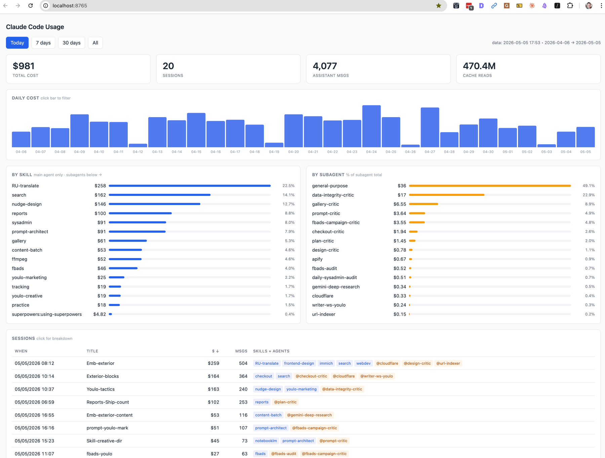

# Claude Code Usage Dashboard

Локальный дашборд по тратам и активности в Claude Code. Читает твои транскрипты из `~/.claude/projects/*.jsonl`, считает стоимость по официальным тарифам Anthropic и показывает разбивку: по дням, по скиллам, по сабагентам, по сессиям.

Всё работает локально — никакие данные никуда не уходят. Никаких API-ключей, авторизации, телеметрии.



## Что нужно

- macOS или Linux (на Windows работает через WSL)
- Python 3.8+ (на маке уже стоит — проверка: `python3 --version`)
- Установленный Claude Code, которым ты хоть раз пользовался — неважно, через терминал или десктопное приложение. Главное чтобы появилась папка `~/.claude/projects/`.

## Установка

Открой Терминал (на маке: Cmd+Space → «Terminal») и вставь:

```
git clone https://github.com/Glebtum/cc-usage-dashboard.git
cd cc-usage-dashboard
chmod +x open.sh
```

Если `git` не установлен, можно скачать архив кнопкой **Code → Download ZIP** на странице репо, распаковать и в Терминале сделать `cd` в эту папку.

## Запуск

```
./open.sh           # последние 30 дней
./open.sh 7         # последние 7 дней
./open.sh 365       # за год
```

Скрипт сам:
1. Соберёт данные из `~/.claude/projects/` в файл `data.json`
2. Поднимет локальный веб-сервер на `http://localhost:8765`
3. Откроет дашборд в браузере

Чтобы остановить — закрой Терминал или выполни `kill $(lsof -ti:8765)`.

## Что увидишь

- **Total cost** — сколько потратил за период (рассчитывается из токенов × прайс Anthropic)
- **Daily cost** — столбики по дням, можно кликнуть на день и отфильтровать таблицу сессий
- **By skill** — какие `/скиллы` съели больше всего
- **By subagent** — какие сабагенты (Task) съели больше всего
- **Sessions** — таблица всех сессий: название, стоимость, количество сообщений, какие скиллы/агенты использовались

## Если что-то пошло не так

- **«python3: command not found»** — на маке поставь Xcode Command Line Tools: `xcode-select --install`. На Linux — `sudo apt install python3`.
- **«Permission denied: ./open.sh»** — забыл `chmod +x open.sh`.
- **Дашборд пустой / `total $0`** — значит в `~/.claude/projects/` нет транскриптов за выбранный период. Поработай с Claude Code и запусти заново. Проверить что папка есть: `ls ~/.claude/projects/`.
- **Порт 8765 занят** — скрипт сам убивает старый процесс на этом порту, должно работать. Если нет — открой `open.sh` и поменяй `PORT=8765` на что-нибудь другое.

## Заметки

- Цены захардкожены (Opus 4.7 / Sonnet 4.6 / Haiku 4.5). Если Anthropic поменяет тарифы или ты используешь другие модели — поправь словарь `PRICES` в файле `usage_breakdown.py`.
- Стоимость — оценка по токенам из транскриптов, должна сходиться с биллингом Anthropic в пределах нескольких процентов.
- Скиллы определяются по `/command-name` и путям к скиллам в первых сообщениях сессии — иногда могут не распознаться, тогда сессия попадёт в `(no-skill)`.
